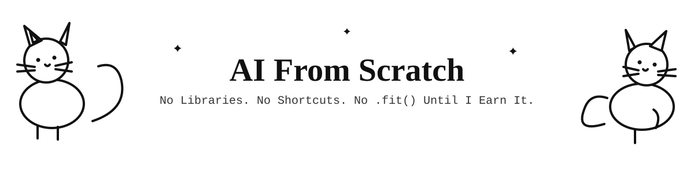

<div align="center">




</div>

---

## ✨🧠✨ The Philosophy

Most people learn AI backwards: import a library, call three functions, get a number, call themselves an ML engineer. I'm doing the opposite. ⭐

**⭐ Rule #1:** If I can't code it in plain Python/NumPy, I don't actually understand it — I just know the API.

**⭐ Rule #2:** Math isn't a prerequisite chapter to rush through. It's the whole plot. Gradient descent, backprop, loss functions — these ARE the model, not a footnote.

**⭐ Rule #3:** Libraries come *after*. scikit-learn and PyTorch are the reward for doing it manually first, not a shortcut around it.

> Basically: build the engine before you drive the car. 🚗💨

---

## 🗺️✨ The Roadmap

| Stage | What | Status |
|---|---|---|
| 01 | Math foundations (linear algebra, calculus, probability) | 🔲 |
| 02 | Core ML concepts (loss, overfitting, evaluation) | 🔲 |
| 03 | Model classification (supervised / unsupervised / RL) | 🔲 |
| 04 | Classical models from scratch (regression → SVM → trees) | 🔲 |
| 05 | Neural networks from scratch (perceptron → backprop) | 🔲 |
| 06 | Deep learning architectures (CNN, RNN, Transformers) | 🔲 |
| 07 | Rebuild everything with real libraries, compare | 🔲 |

*(Full roadmap breakdown: [`ROADMAP.md`](./ROADMAP.md))*

---

## 📂 Repo Structure

```
AI-From-Scratch/
├── README.md                  ← you are here ⭐
├── ROADMAP.md                 ← the full detailed plan
├── 01-math/
├── 02-supervised/
│   ├── regression/
│   └── classification/
├── 03-unsupervised/
│   ├── clustering/
│   └── dimensionality-reduction/
├── 04-neural-networks/
│   ├── mlp/
│   ├── cnn/
│   ├── rnn-lstm/
│   └── transformers/
└── 05-projects/
```

Each folder = `notes.md` (concept + math) + code (raw Python first, library version second).

---

## ⚙️ Stack


*(PyTorch/scikit-learn badges = the destination, not the starting point)*

---

## 📌 Why This Exists

Started this because a teacher said "learn it from scratch" and meant it literally. So this repo is proof of work — every model, every derivative, every bug — documented as I go.

No AI wrote these models for me. I wrote the AI.

---

<div align="center">

### ⭐ Star History

[](https://star-history.com/#YOUR-USERNAME/AI-From-Scratch&Date)

**If you're also doing the from-scratch grind, fork it and race me.** ⭐🧠⭐


</div>
