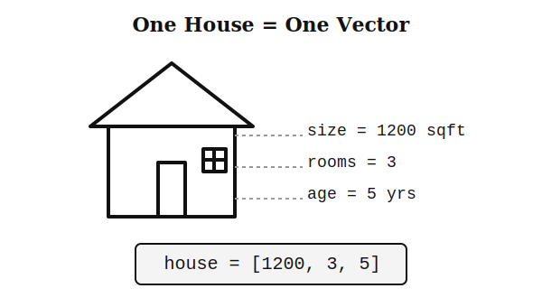
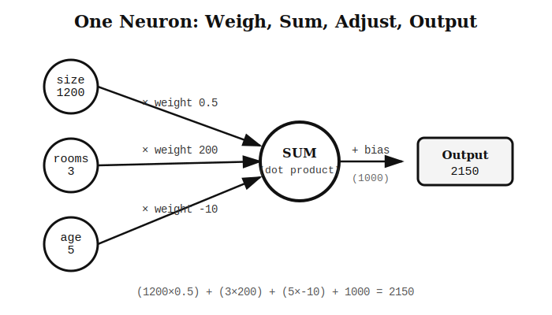
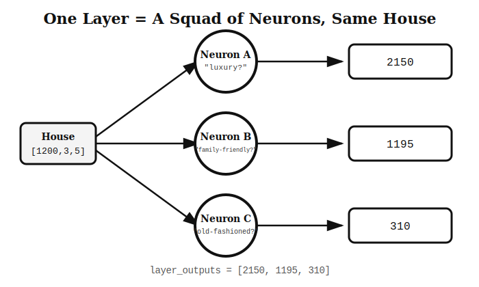

# 📘 Class 1 — Neurons, Weights, Bias & The Math Behind Them

*"You've been running a neural network in your head your whole life. You just didn't know the math for it. Let's fix that."*

---

## 🧠 Part 1: What are a Neuron, Weight, and Bias? (No math yet — just vibes)

Imagine you're house-hunting. A friend asks: *"So, would you buy this house?"*

In your head, you're weighing a few things:
- **Size** — big deal for you, you care A LOT
- **Number of rooms** — matters, but not hugely
- **Age of the house** — eh, barely register it

You silently combine all of that into one gut-feeling score, and blurt out "yeah, decent, 7/10."

Congrats — you just did the job of a **neuron**.

| Term | What it really means |
|---|---|
| **Weight** | How much you personally care about one specific factor. Size = high weight. Age = low weight. |
| **Bias** | Your personal starting mood, regardless of the house. A picky friend starts every house at "meh" (negative bias). An easy-to-impress friend starts at "already love it" (positive bias). |
| **Neuron** | The whole process: weigh every factor by how much you care, add it all up, then adjust by your personal bias → one final verdict. |

That's it. No mysticism, no brain-simulation nonsense. **A neuron is just a tiny opinionated calculator.**

---

## 🏠 Part 2: Meet Our Example House (this house appears everywhere below)



We'll keep coming back to this exact house. Its stats, as a clean list:

```
house = [1200, 3, 5]
```

---

## 🔢 Part 3: The Math Vocabulary (now that you get the idea)

### Scalar — just ONE number
`5`, `-2.3`, `1000`. That's the whole definition. A weight is a scalar. A bias is a scalar.

### Vector — a list of numbers describing ONE thing
Our house above, as a list: `[1200, 3, 5]`. One vector = one "profile."

### Matrix — a bunch of vectors, stacked
Comparing 3 houses at once:
```
[[1200, 3, 5],
 [800,  2, 10],
 [2000, 4, 1]]
```
A matrix is just a spreadsheet — or, as you'll see soon, a whole squad of neurons' weights stacked together.

### Dot Product — "multiply matching, then add" 🧮
```
a = [1, 2, 3]
b = [4, 5, 6]
dot = (1×4) + (2×5) + (3×6) = 4 + 10 + 18 = 32
```
This unassuming little operation is secretly *the entire math* behind "weighing things and combining them" from Part 1.

---

## ⚡ Part 4: The Neuron, In Full Math Form



```
output = (size × weight_size) + (rooms × weight_rooms) + (age × weight_age) + bias
```

Plug in real numbers:
```
inputs  = [1200, 3, 5]
weights = [0.5, 200, -10]
bias    = 1000

output = (1200×0.5) + (3×200) + (5×-10) + 1000
       = 600 + 600 - 50 + 1000
       = 2150
```

That's a dot product (`inputs · weights`) plus a bias. One neuron, one number out.

---

## 🧑‍🤝‍🧑 Part 5: A Layer — Get a Whole Squad to Judge the Same House

Why stop at one opinion? Bring in 3 neurons, each caring about something different:



- **Neuron A** cares about luxury → verdict: `2150`
- **Neuron B** cares about family-friendliness → verdict: `1195`
- **Neuron C** cares about how old-fashioned it feels → verdict: `310`

Same house, three separate opinions. Stack each neuron's weight-list on top of each other, and you get a **matrix** that's why "a layer's weights form a matrix."

```python
weights_matrix = [
    [0.5, 200, -10],   # Neuron A
    [0.1, 300, -5],    # Neuron B
    [0.05, 50, 20],    # Neuron C
]
biases = [1000, 200, 0]
```

---

## 💻 Part 6: The Code (from scratch — zero libraries)

```python
def dot_product(a, b):
    total = 0
    for i in range(len(a)):
        total += a[i] * b[i]
    return total

inputs = [1200, 3, 5]

weights_matrix = [
    [0.5, 200, -10],
    [0.1, 300, -5],
    [0.05, 50, 20],
]
biases = [1000, 200, 0]

layer_outputs = []
for neuron_weights, neuron_bias in zip(weights_matrix, biases):
    output = dot_product(inputs, neuron_weights) + neuron_bias
    layer_outputs.append(output)

print(layer_outputs)   # [2150, 1195, 310]
```

Run it. That's a real, working neural network layer no libraries, no shortcuts, just loops and arithmetic.

---

## 🎯 The Whole Class in 6 Bullet Points

- **Weight** = how much a neuron cares about one input
- **Bias** = a neuron's fixed personal starting adjustment
- **Neuron** = weigh every input, sum them (dot product), add bias → one verdict
- **Vector** = one thing, described as a list of numbers
- **Matrix** = many things stacked (or a whole layer's weights)
- **Layer** = a squad of neurons, same input, each with a different opinion

---

*Next up (Class 2): how a network figures out the right weights and biases *on its own* instead of us guessing numbers by hand like we did here.*
